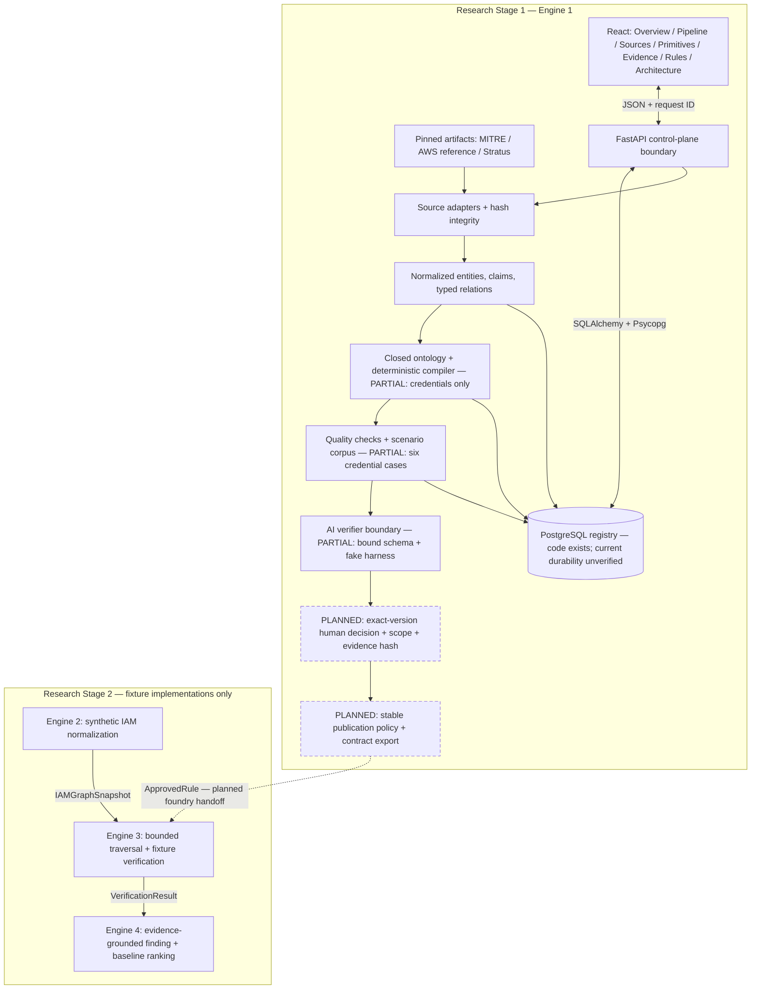

# Engine 1 architecture and control plane

Status: **Implemented multi-page local control plane; incomplete foundry product.**
Date: 2026-10-03. This document describes the current worktree. It does not accept the Proposed cross-engine contracts or supersede the required three-family scope in [the foundry spec](14_ENGINE_1_RESEARCH_GRADE_FOUNDRY_SPEC.md).

## Target flow and current implementation

Solid boxes below have local implementations. Dashed boxes are required follow-up work. Partial boxes exist but do not satisfy the complete FYP scope.

The preview entry point computes pinned evidence in memory and has no PostgreSQL connection, durable review, publication, or Engine 3 export. The normal API entry point uses the PostgreSQL registry. These are distinct modes, not an automatic fallback. A failed database must not silently become a successful persisted preview.

## Page map

| Address | Purpose | Current boundary |
|---|---|---|
| `/#/overview` | Run posture and operator attention | Selected rule only; no global release inventory claim |
| `/#/pipeline` | Pipeline stages and latest source statuses | No historical attempt timeline or retry ancestry yet |
| `/#/sources` | Pinned versions, enabled inputs, health | AWS TTC remains disabled |
| `/#/primitives` | Actions, transitions, mapping state | Mapping is not compilation or approval |
| `/#/evidence` | Typed relations and rationale | Relation acceptance is not rule approval |
| `/#/rules` | Candidate dossier, checks, scenarios, limits | No durable decision or comparison action yet |
| `/#/architecture` | Stage boundaries and future integrations | Available without a connected registry |

The URL is the page state. Links support bookmarks, reload, and browser Back/Forward without a new router dependency or server rewrite configuration. The existing `#sources`, `#primitives`, and `#evidence` bookmarks remain usable. Unknown routes expose a recovery view. Page transitions move focus to the single page heading; navigation identifies its current page. Detailed panels are rendered only in their workspace.

Hash routing was chosen for the existing local Vite/FastAPI development setup. If deployment later requires clean path URLs or nested version routes, replace this small route adapter behind its navigation tests; do not spread manual route parsing through components.

## Source of implementation truth

- `frontend/src/foundry-navigation.ts`: supported routes and history subscription.
- `frontend/src/FoundryScreen.tsx`: shared shell, mode warnings, navigation, focus, run action.
- `frontend/src/FoundryPages.tsx`: focused views, operator brief, architecture diagram.
- `frontend/src/FoundryPanels.tsx`: structured source, primitive, evidence, and rule panels.
- `src/fyp_iam/api/app.py` and `schemas.py`: typed API boundary.
- `src/fyp_iam/engine1/foundry/preview.py`: explicit non-persistent mode.
- `src/fyp_iam/engine1/foundry/store.py` and `models.py`: PostgreSQL implementation.
- [Execution plan](15_ENGINE_1_EXECUTION_PLAN.md): remaining product and research tasks.

## Completion audit — still open

The improved portal does not complete Engine 1. Required remaining work includes both additional rule families and their primary evidence/closed ontologies; reproducible experiment exports; exact-version durable review and publication enforcement; run history and version comparison UI; complete stored-workflow browser verification; and release/security checks for the intended deployment. Quality-report storage/history, fresh migration, reconstructed legacy-schema upgrade, and actual PostgreSQL restart passed locally; see `19_POSTGRES_VERIFICATION.md`. Managed deployment remains unverified. The local version-bound deterministic report is described in `18_RULE_QUALITY_REPORT.md`. A real-model evaluation is conditional on the spec's privacy, cost, and supervisor approval; no paid provider has been enabled.

The current verifier is a fake harness. Optional external tools are unavailable. Live AWS collection, simulation, and mapped sandbox verification are not implemented. The preview is a local demonstration and must not be exposed as an authenticated production service. Login roles remain outside the selected slice.

## Navigation verification

ECC `react-testing` and `frontend-a11y` shaped the behavior-focused tests, semantic links, current-page indication, and route focus. The documentation skill preserves implemented/partial/planned distinctions.

RED: the first route-focused `FoundryScreen.test.tsx` run had five intended failures: the old page rendered unrelated panels, ignored route changes, and had no overview, architecture, or unknown-route view. A second regression test exposed assurance appearing complete when a required check failed. GREEN: all ten screen tests and three API-client tests passed; `npm run build` passed. Edge browser tests cover the live preview dossier/recompute, a mocked persisted response, deep-link reload, Back, keyboard activation/focus, and overflow checks on every page at 320/768/1024/1440px. Desktop and mobile screenshots were inspected. These tests do not prove durable storage or production readiness. No coverage percentage or automated axe audit is claimed. Changes remain uncommitted to avoid incorporating unrelated dirty-worktree changes into checkpoint commits.

Final backend regression checks: `pytest -m "not postgres"` passed 158 tests (two PostgreSQL tests deselected), mypy passed all 66 source files, Ruff lint passed and formatting reported 131 files already formatted. The Ruff check initially included vendored ECC examples; `.cursor/skills` is now excluded while application code remains checked. `git diff --check` passed. One existing Starlette/httpx deprecation warning remains.
