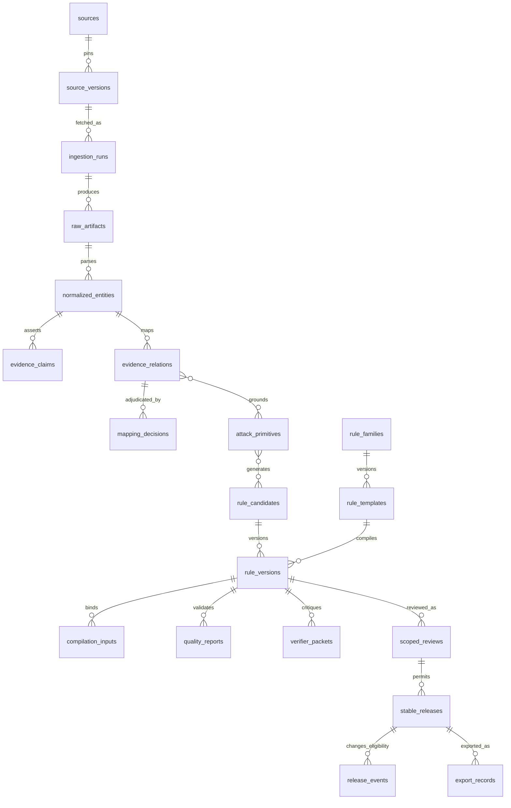
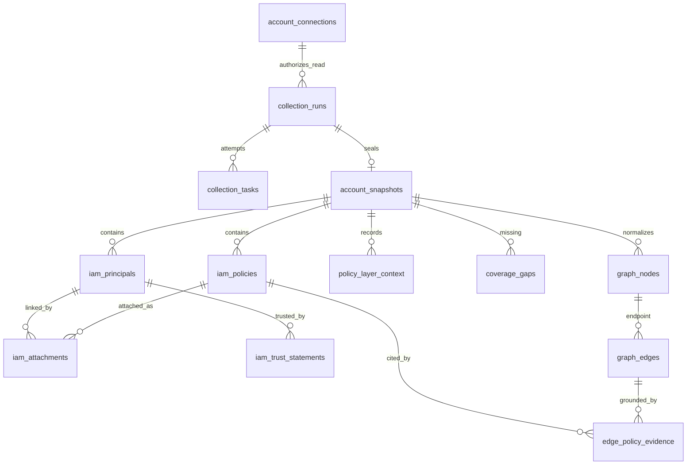
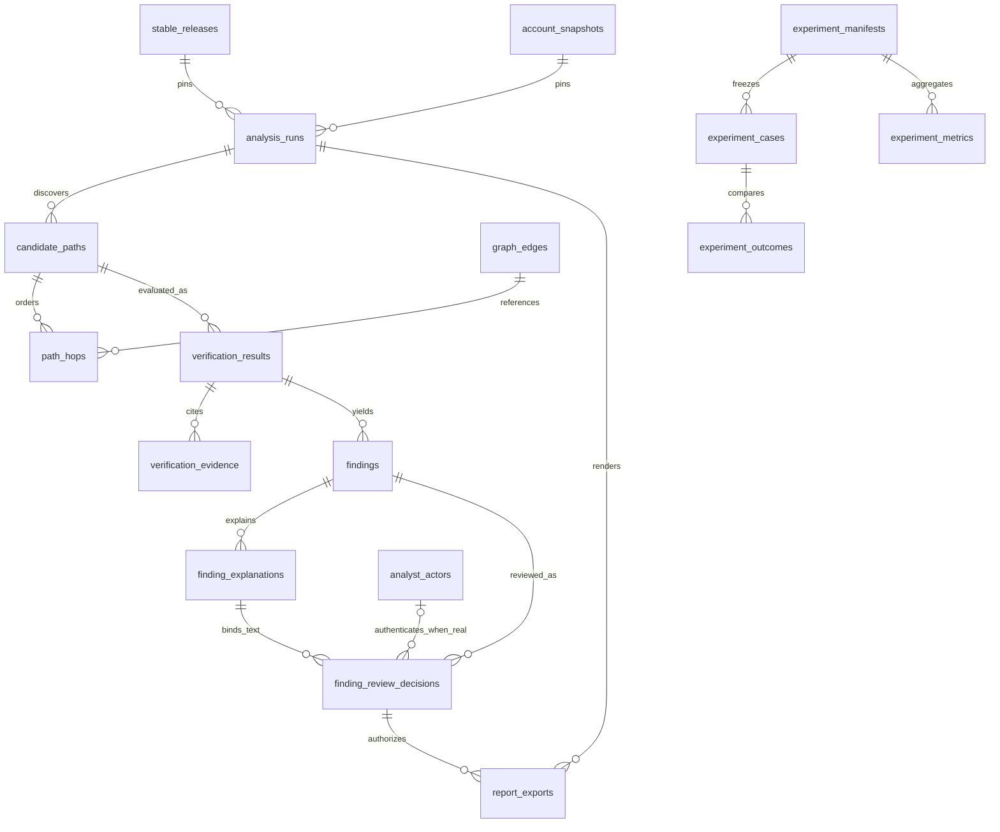
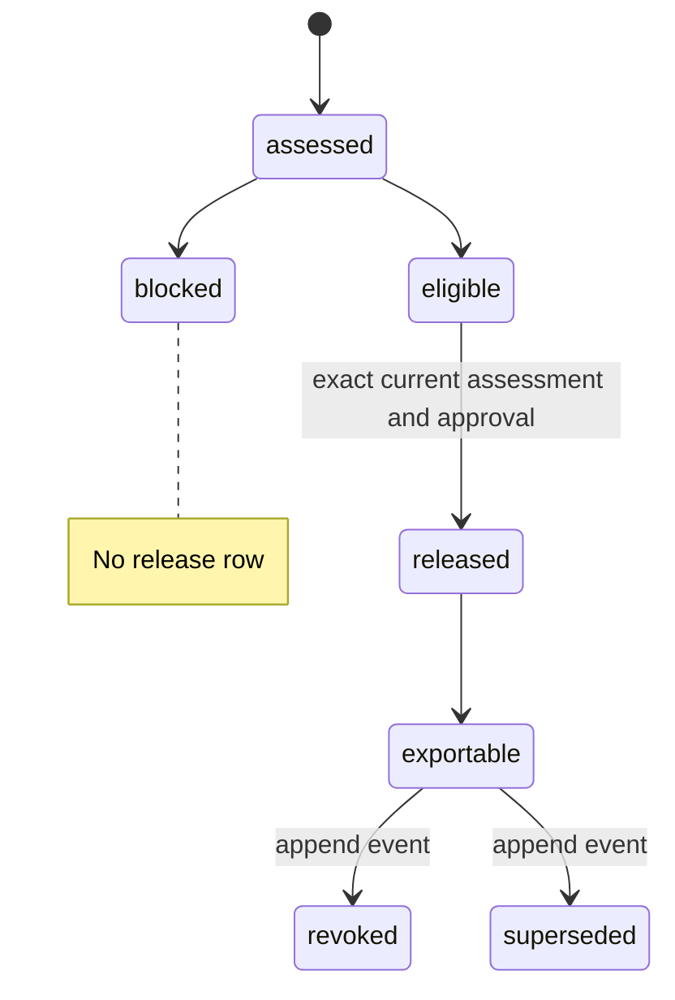
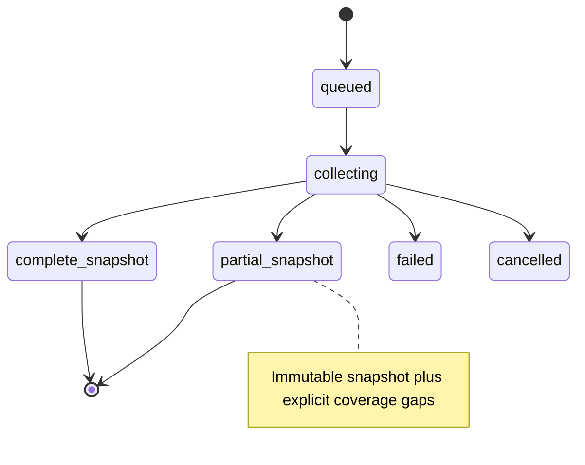

# Whole-product PostgreSQL schema v0.1 — **PROPOSED, NOT APPROVED**

Date: 2026-10-08. Companion: [observed database audit](23_SCHEMA_CURRENT_STATE_AUDIT.md). **Design only:** no migrations, feature work, RLS/privilege changes, credentials, or AWS calls were made. This proposal is deliberately incremental over the live `foundry` 0004 schema; it does not authorize implementation. PostgreSQL in the existing Supabase project is the system of record. There is no demonstrated need for Neo4j or Redis. A single FYP project and private server-side DB role are assumed; multi-tenancy and browser-direct Supabase access are deferred.

## Design invariants and conventions

1. Names use `foundry.snake_case`; existing string IDs remain opaque `varchar(80)` for compatibility. New IDs may use the same convention; do not change existing PK types for aesthetics. All event timestamps are `timestamptz` UTC. Hashes are tagged SHA-256 over canonical bytes and checked by application code; a hash is an integrity/deduplication aid, **not** an authorization or signature.
2. Existing 0004 rows remain. New records are append-only unless a row is explicitly marked operational/mutable. Do not mutate semantic evidence, rule versions, reviews, releases, snapshots, results or reports. Status updates on operational run/queue rows are allowed with guarded transitions; terminal state is immutable. Never backfill an approval, release, verification, or observed AWS outcome from legacy aliases or JSON.
3. `source_*` facts are not executable rules. A typed relation may be proposed/rejected/unsupported; an accepted relation is still evidence, not a rule approval. AI is a bounded critique and cannot write approval/release fields. A policy `Allow` is a statement, not an effective-permission verdict. `unknown` is retained whenever a required layer/context is absent.
4. Only the backend accesses private `foundry` tables. Existing 0004 privilege revocations are preserved; locally authored 0009–0011 enable fail-closed RLS with no browser policy on their **new** tables, while existing 0004 tables remain unchanged. A future backend role/grant policy still needs review. Do not put a Supabase service role key in the frontend. Real-account identifiers are represented by aliases and keyed fingerprints; no AWS secret or access-key value is stored. Raw/redacted policy data and free text require length caps, validation and restricted retention.
5. Stable columns (`status`, `scope`, `action`, `effect`, timestamps, FK/hash) are relational. Bounded `jsonb` is only for changing source-specific attributes, normalized policy conditions, critique payloads, and versioned report bodies; new migrations should not convert old text JSON in place without a validated backfill. Use checks for byte length, `jsonb_typeof`, allowed statuses and transition rules at service boundary. FK indexes are explicit where queried. Avoid arbitrary JSONB GIN indexes until queries justify them.
6. Every derived result binds `contract_version`, code/adapter version, immutable input IDs **and** content digests. Disallow cross-snapshot graph edges/hops and cross-release analysis by composite FK or transactional validation. Read/export API must recheck current eligibility separately from archival release existence. Append revocation/supersession rather than editing release bytes.
7. Data classes below: `S` = public/curated source intelligence, `Y` = synthetic benchmark, `A` = sensitive redacted real AWS account data, `M` = operational metadata. `I` = append-only immutable content, `O` = operational mutable status, `R` = mutable registry/config. `A` has a **chosen 90-day maximum design default** ([ADR-018](decisions/ADR-018-redacted-aws-snapshot-retention.md)); purge/backups and owner consent remain unimplemented. Proposed `S/Y` retention is until research artifact freeze + 2 years and `M` is 1 year. Audit/review/release tombstones retain non-sensitive IDs/hashes only under a reviewed purge policy. No real-account retention is active yet.

### Major entities and trust boundaries







`account_snapshots` and every account-dependent descendant are private `A` data. Source IDs cannot be used as AWS policy evidence; an Engine 3 hop cites Engine 2 policy evidence separately. Synthetic snapshots use the same relational shape with `data_kind=synthetic`, but all claim types remain explicit.

## Table specification

Notation: all table names are in `foundry`; `PK`, `FK`, `UQ`, `CK`, `IX` describe constraints/indexes required by this proposal. Existing keys/checks are retained unless a later reviewed migration says otherwise. `P` = proposed added table; `E` = existing live 0004 table; `M` = model/migration 0005–0008 table **not live**. The lifecycle/class, writer→reader, sensitive/retention (`none` or policy above), and example workflow appear on **every** row. These rows specify logical schema v0.1, not executable DDL. Existing columns are inventoried in the audit; added columns are named here.

### Source and Engine 1 — preserve the 0004 core

| Table / purpose | Key design and query indexes | Lifecycle, class, actors, privacy, example |
|---|---|---|
| `sources` E — source registry | PK source_id; UQ source_key; CK tier/type; add `freshness_sla_hours>0`, `authority_kind ∈ official/community/contextual`; IX(enabled,source_key) | R/S; curator→adapter/UI; public metadata, S retention; list enabled official feeds due for refresh. |
| `source_versions` E — version pin | PK version_id; FK source_id; UQ(source_id,content_hash); add `observed_at`, `superseded_by` nullable self-FK; IX(source_id,discovered_at DESC) | I/S; adapter→compiler; public, S; retrieve exact version for a rule. |
| `pipeline_runs` E — bounded orchestration | PK run_id; self-FK parent; CK status/attempt≥1/terminal finished_at; UQ proposed idempotency_key; IX(status,started_at) | O/M; runner→ops/UI; sanitized errors, M; resume a failed bounded run. |
| `ingestion_runs` E — per-source adapter attempt | PK ingestion_id; FKs pipeline/source/version/retry; CK status/counters≥0; UQ(pipeline_run_id,source_id,attempt); IX(source_id,started_at DESC) | O/M+S; adapter→ops/UI; sanitized errors, M; show one source failure without erasing good sources. |
| `raw_artifacts` E — immutable bytes or URI | PK artifact_id; FKs source_version/ingestion; UQ(version,native_id,hash); CK exactly one of payload/URI, byte_count≥0, SHA verified; IX(content_hash) | I/S; adapter→parser/auditor; bounded public source bytes, S; reproduce a claim from a pinned artifact. |
| `normalized_entities` E — typed source item | PK entity_id; FKs source_version/artifact; UQ(type,native_id,version); CK type; IX(artifact_id) | I/S; parser→mapper/UI; bounded attributes, S; locate AWS action in a version. |
| `evidence_claims` E — extracted assertion | PK claim_id; FKs subject/object entity/artifact; UQ existing claim identity; CK valid_to≥valid_from; IX(subject_entity_id,predicate) | I/S; parser→mapper/reviewer; bounded excerpt/location, S; trace action claim to source offset. |
| `evidence_relations` E — typed correlation | PK relation_id; FKs both entity IDs; UQ existing relation identity; CK review_state; add `relation_schema_version`; IX(from_entity_id,relation_type), IX(to_entity_id) | I/S; mapper→compiler/reviewer; public rationale, S; list accepted relation candidates with evidence. Review changes append `mapping_decisions`, not overwrite history. |
| `evidence_relation_claims` E — provenance join | PK(relation_id,claim_id); FKs both; IX(claim_id) | I/S; mapper→reviewer; none, S; explain why a relation was suggested. |
| `attack_primitives` E — closed behavior vocabulary | PK primitive_id; UQ(key,generator_version); CK mapping state; IX(outcome_category) | I/S; deterministic compiler→rule factory; public, S; select one credential-creation primitive. |
| `primitive_relations` E — primitive evidence | PK(primitive_id,relation_id); FKs both; IX(relation_id) | I/S; compiler→reviewer; none, S; prove primitive lineage. |
| `rule_candidates` E — family-specific candidate | PK candidate_id; CK lifecycle; add FK family_id to `rule_families`; IX(family_id,lifecycle) | O/S; compiler→review queue; public rule metadata, S; list candidates awaiting review. Lifecycle is not approval. |
| `candidate_primitives` E — candidate inputs | PK(candidate_id,primitive_id); FKs both; IX(primitive_id) | I/S; compiler→reviewer; none, S; inspect candidate's behavior inputs. |
| `candidate_entities` E — candidate source refs | PK(candidate_id,entity_id); FKs both; IX(entity_id) | I/S; compiler→reviewer; none, S; inspect candidate's source anchors. |
| `rule_versions` E — immutable proposed rule bytes | PK version_id; FKs candidate/parent; UQ(candidate_id,rule_version); CK version>0/hash; add FK template_version_id; IX(candidate_id,rule_version DESC) | I/S; compiler→quality/review/consumer; public bounded rule JSON, S; fetch exact version for release. Never edit `rule_json` after publication. |
| `validation_runs` E — deterministic check record | PK validation_id; FK rule_version; add FK test_run_id nullable; CK result and duration≥0; IX(rule_version_id,executed_at DESC) | I/S+M; validator→quality/reviewer; bounded sanitized findings, S; show validator failure for exact version. |
| `ai_verifications` E — critique summary, not authority | PK verification_id; FK rule_version; CK verdict; add nullable FK verifier_packet_id; IX(rule_version_id) | I/S; critic adapter→reviewer; bounded public-only critique, S; compare critic citations with deterministic checks. Legacy row remains distinct. |
| `ai_suggestions` E — non-executable suggestions | PK suggestion_id; FKs verification/rule_version; CK payload size; IX(verification_id) | I/S; critic→reviewer; sanitized text, S; show critique without applying it. |
| `review_decisions` E — legacy alias event | PK decision_id; FK rule_version; IX(rule_version_id,decided_at DESC) | I/S; legacy local route→audit; alias not identity, S; historical view only. **Never** auto-promote to scoped approval. |
| `publications` E — legacy experimental registry | PK publication_id; FK rule_version; UQ(version,channel); CK channel; IX(channel,published_at DESC) | I/S; legacy compiler→registry; public, S; show experimental history. **Never** treat as stable release. |
| `audit_events` E — cross-cutting event trail | PK event_id; polymorphic object_type/id; add actor_kind, request_id; IX(object_type,object_id,recorded_at), IX(correlation_id) | I/M; backend→auditor; sanitized IDs/hashes only, M; explain why a run/review/export happened. No secrets or raw policy text. |

### Proposed additions to Engine 1 and review

| Table / purpose | Key design and query indexes | Lifecycle, class, actors, privacy, example |
|---|---|---|
| `mapping_decisions` P — accept/reject/no_supported_mapping/uncertain | PK decision_id; FK relation_id nullable, source_version_id, claim_id nullable; UQ(source_version_id,subject_entity_id,decision_version); CK decision/rationale/actor_kind; IX(source_version_id,decided_at DESC) | I/S; curator→compiler/auditor; alias and rationale, S; demonstrate T1548 was rejected or no mapping exists. `subject_entity_id` FK required. |
| `rule_families` P — allowlisted rule families | PK family_id; UQ family_key; CK active flag; IX(active,family_key) | R/S; maintainer→compiler/UI; public, S; list supported behaviors. |
| `rule_templates` P — deterministic template version | PK template_version_id; FK family_id; UQ(family_id,version); CK content hash/code version; IX(family_id,version DESC) | I/S; maintainer→compiler; public source-controlled template digest, S; reproduce compilation. |
| `compilation_inputs` P — exact input binding | PK input_id; FK rule_version, template_version, source_version nullable; UQ(rule_version,input_kind,input_ref); CK kind/hash; IX(rule_version_id) | I/S; compiler→reviewer; source hashes, S; identify stale pin after update. Include corpus/compiler versions as typed kinds. |
| `scenario_corpora` P — frozen corpus versions | PK corpus_id; UQ(family_id,version,content_hash); FK family; CK case_count≥0; IX(family_id,version DESC) | I/Y; test maintainer→validator/evaluator; synthetic only, Y; select six-case version used by a check. |
| `scenario_cases` P — expected synthetic behavior | PK case_id; FK corpus_id; UQ(corpus_id,case_key); CK expected_status and input hash; IX(corpus_id,case_key) | I/Y; maintainer→test runner; no real IDs, Y; test explicit deny/missing context. |
| `scenario_test_runs` P — observed matrix | PK test_run_id; FKs rule_version/corpus; UQ(rule_version,corpus,runner_version,input_hash); CK status/counts; IX(rule_version_id,started_at DESC) | I/Y+M; runner→quality/evaluation; no secrets, Y; compare expected vs observed outcomes. Per-case outcome lives in `experiment_outcomes` only for formal experiments; ordinary tests may use bounded result JSONB. |
| `quality_reports` M — immutable semantic gate | PK report_id; FK rule_version; UQ(version,report_hash); CK status/size; IX(rule_version_id,created_at DESC) | I/S+M; quality service→review/publication; bounded report, S; fetch exact gate. Defined by 0005, not live. |
| `quality_observations` M — run observation of report | PK observation_id; FKs report/version/pipeline; UQ(run,report); IX(version,observed_at,id) | I/M; runner→review; bounded report observation, M; latest exact quality input. Defined by 0005, not live. |
| `verifier_packets` M — exact bounded critique request/result | PK packet_id; FKs run/version; UQ(run,request_hash,response_hash); CK request/response byte caps; IX(rule_version_id,created_at DESC) | I/S+M; critic harness→review; public-source-only input, S; recheck critique citations. Defined by 0006, not live; fake ≠ real AI. |
| `review_assignments` P — operational queue | PK assignment_id; FK rule_version; UQ(version,scope,active_slot) implemented via partial unique index; CK status/due_at; IX(status,created_at) | O/M; backend/operator→reviewer UI; alias only until auth, M; show pending exact-version work. Assignment is not decision. |
| `scoped_reviews` M — exact-input decision history | PK decision_id; FKs rule_version; UQ request_id; CK record size, scope; IX(version,scope,decided_at,id) | I/S+M; local operator→publication; alias/rationale, S; locate latest review bound to quality/evidence hashes. Defined by 0007, not live. |
| `publication_assessments` P — frozen evaluation of eligibility | PK assessment_id; FKs rule_version, quality_report, verifier_packet nullable, scoped_review nullable; UQ(version,scope,channel,input_hash); CK result/blocker-code array bounds; IX(version,scope,computed_at DESC) | I/S+M; publication policy→operator; hashes and sanitized blockers, S; explain why stable release was blocked. Current computed GET need not persist until policy frozen. |
| `stable_releases` M — immutable approved envelope | PK release_id; FKs rule_version/scoped_review; UQ request_id; CK record size/scope; IX(rule_version_id,scope,published_at DESC) | I/S; publisher→Engine 3 exporter; alias is not auth, S; export exact synthetic benchmark release. Defined by 0008, not live. |
| `release_events` P — revoke/supersede without editing release | PK event_id; FK release_id, replacement_release_id nullable; UQ(request_id); CK event_type/rationale; IX(release_id,created_at DESC) | I/S+M; authorized operator→export gate/audit; actor alias/description, S; block revoked release. Real-account authorization still needs separate approval policy. |
| `export_records` P — point-in-time release delivery | PK export_id; FK release_id, analysis_run_id nullable; UQ(request_id); CK scope/decision/input hash; IX(release_id,exported_at DESC) | I/M; trusted exporter→Engine 3/audit; no raw rule duplication, M; prove which release was supplied to analysis. |

### Engine 2 — collection and observed graph, **0009–0011 local drafts only**

The first read-only collector should support only the actions/layers required by one approved family. `account_connections` contains profile **name/alias** and expected fingerprint, never credential bytes. Actual account IDs/ARNs should be HMAC'd with a key outside the database; stable normalized aliases remain usable for local joins. Sanitized canonical policy statements may be retained inside `A` tables to reproduce derivation. If essential policy semantics cannot be represented safely, mark coverage unknown instead of storing unrestricted raw documents. All snapshot-dependent FKs should enforce same `snapshot_id` through composite keys or transactional validation.

| Table / purpose | Key design and query indexes | Lifecycle, class, actors, privacy, example |
|---|---|---|
| `account_connections` P — read-only target configuration | PK connection_id; UQ(project_key,account_fingerprint); CK project_key=fyp, provider=aws, credential_mode external_profile/synthetic_fixture; IX(enabled) | R/A or Y; operator→collector; alias/fingerprint only, A/Y; choose authorized sandbox or fixture without storing keys. `project_key` is constant FYP v0.1, not tenant isolation. |
| `collection_runs` P — bounded attempt | PK collection_run_id; FK connection_id; composite FK(retry_of,connection_id) prevents cross-connection retry; UQ(request_id); CK status/attempt/terminal timestamp and sanitized error state; IX(connection_id,started_at) | O/A+M; collector→ops; sanitized errors, A; resume only missing reads after throttling. |
| `collection_tasks` P — per API/layer/**principal scope** result | PK task_id; FK collection_run_id; UQ(run,api_name,scope_key,attempt), UQ(run,sequence_no); CK sequence 0–999, status/error_code/non-negative item and page counts/pagination_complete, bounded response digest; IX(run,status), IX(run,scope_key,api_name) | O/A+M; collector→coverage; ordered task record, HMAC scope key and sanitized response digest, no response bodies, A; distinguish one user's failed `ListGroupsForUser` from another user's complete zero-group result. |
| `account_snapshots` P — immutable collection seal | PK snapshot_id; composite FK(collection_run_id,connection_id) to same run/connection; UQ(collection_run_id), UQ(snapshot_id,collection_run_id); CK data_kind real/synthetic, seal_status, SHA-256 inventory `content_hash` and whole-`CollectionHandoff` `handoff_hash`, real expiry ≤90 days and synthetic expiry ≤2 years; IX(connection_id,sealed_at), nonunique IX(connection_id,content_hash) | I/A or Y; collector/fixture importer→Engine 3; alias/fingerprint, A/Y; pin inventory **and** task/coverage context for a finding. Identical content on later runs is allowed; request ID controls retry idempotency. A failed/partial run may seal a partial snapshot with gaps. The expiry check does not itself delete data. |
| `collection_layer_coverage` P — all declared policy-layer observations | PK(snapshot_id,layer); composite FK(snapshot_id,collection_run_id) to the same sealed snapshot/run; CK layer/state/count/reason and `authorization_evaluated=false`; IX(snapshot_id,state) | I/A or Y; collector→resolver/analyst; seven sanitized layer summaries, A/Y; distinguish observed absence from a read that never happened. Global layer rows do not replace principal-scoped gaps or prove AWS provenance. |
| `iam_principals` M — user/group/role metadata | PK(snapshot_id,principal_key); FK snapshot; UQ(snapshot_id,principal_fingerprint); CK kind, opaque key/HMAC/digest/alias; IX(snapshot_id,kind) | I/A or Y; normalizer→graph; no raw name/ARN, A/Y; list observed starting identities. Assumed-role sessions are not in this 0010 handoff. |
| `iam_policies` M — exact policy version metadata | PK(snapshot_id,policy_key); FK snapshot; CK managed/inline/trust kind, version/default/parse state and source digest; IX(snapshot_id,kind) | I/A or Y; collector→resolver; no raw policy JSON, A/Y; retrieve default version and parse state. |
| `iam_identity_statements`, `iam_statement_resource_refs` M — redacted identity-policy semantics | PK(snapshot_id,statement_key), FK(snapshot_id,policy_key); typed effect/action/resource/condition states, bounded `varchar[]` patterns/keys; resource-ref PK(snapshot_id,statement_key,principal_key), both composite FKs; IX(snapshot_id,policy_key), IX resource principal | I/A or Y; normalizer→resolver; exact statement/source digest and linked principal keys, no raw condition values; inspect observed `Allow`/`Deny` text without claiming effective permission. |
| `iam_attachments` M — principal-policy linkage | PK(snapshot_id,principal_key,policy_key,kind); composite FKs to same-snapshot principal and policy; CK kind; IX(snapshot_id,policy_key) | I/A or Y; collector→resolver; opaque keys and source digest, A/Y; trace why a policy appears on a user, group, role or boundary. The importer checks kind compatibility. |
| `iam_memberships`, `iam_group_traversals` M — user-group relation and read lineage | Membership PK(snapshot_id,user_key,group_key), composite FKs; traversal PK(snapshot_id,user_key), composite FKs to snapshot/run, user, optional task from same run; CK state/count/digest/reason | I/A or Y; collector→resolver; no raw IAM names, A/Y; distinguish observed zero-group read from missing/denied read. The importer matches complete traversal to one successful task. |
| `iam_trust_statements`, `iam_trust_principal_refs` M — role trust text and linked selectors | PK(snapshot_id,statement_key); composite FKs to trust policy and role; typed effect/action/selector/condition states and bounded arrays; linked-principal ref PK(snapshot_id,statement_key,principal_key) with composite FKs; IX role/ref principal | I/A or Y; collector→resolver; redacted service selectors and source digest, A/Y; inspect `sts:AssumeRole` trust evidence, not permission. |
| `policy_layer_context` P — further principal-scoped boundary/SCP/RCP/session/resource context | Proposed PK layer_id; FK snapshot/principal; UQ(snapshot,scope,layer); CK status; IX(snapshot,layer,status) | I/A or Y; later collector/resolver→verifier; global declarations live in 0009 `collection_layer_coverage`, while richer per-object context remains **not migrated**. |
| `graph_projections` M — observed-only graph seal (0011 local draft) | PK/FK snapshot_id; inventory/handoff/projection digests; resolver version and generated time; CK `authorization_evaluated=false` | I/A or Y; future normalizer→Engine 3; binds an observed projection to one snapshot, but digest equality to its source row still needs importer validation. |
| `graph_nodes` M — observed graph node (0011 local draft) | PK(snapshot_id,node_key); FK projection and composite FK to principal/policy source when applicable; CK kind/key; IX(snapshot_id,kind) | I/A or Y; future normalizer→Engine 3; redacted aliases only; service nodes have no IAM inventory parent. |
| `graph_edges` M — direct observed relationship (0011 local draft) | PK(snapshot_id,relation_id); composite FKs to both same-snapshot endpoints; CK five direct relation kinds and `derivation=observed_configuration`; IX source/target | I/A or Y; future normalizer→Engine 3; no `CAN_*` or effective-allow edge can be stored in this tranche. A later evaluated capability contract needs separate review. |
| `edge_policy_evidence` M — exact source anchor (0011 local draft) | PK(snapshot_id,relation_id,evidence_ordinal); composite FK to edge and exactly one same-snapshot policy, identity statement or trust statement | I/A or Y; future normalizer→analyst; anchors an observed relation, not proof of effective permission. |
| `coverage_gaps` P — missing collection/semantics | PK gap_id; composite FKs(snapshot_id,collection_run_id) and optional (task_id,collection_run_id) prevent a gap citing another run; UQ(snapshot,layer,scope_hash,reason_code); CK layer/state/reason; IX(snapshot_id,reason_code) | I/A or Y; collector/resolver→Engine 3/4; redacted scope, A; turn missing Organizations access into unknown. |

**Proposed group-traversal persistence rule:** derive `InventorySnapshot.group_traversals` from the sealed `collection_tasks` for each user-scoped `ListGroupsForUser` read and, for any discovered group, its managed/inline policy reads. The scope key is a keyed fingerprint, not a raw IAM name or ARN; retain pagination completion, count and a digest of the sanitized source responses. A complete zero-group declaration requires a successful final page for that user and zero stored `InventoryMembership` rows; a denied or truncated read creates a scope-specific `coverage_gaps` row and an unknown analyst state. The Python handoff contract requires a matching declared task for any real-account complete traversal; the proposed 0010 mapper applies this to synthetic records too. Neither can independently prove the collector ran it. 0009–0010 exist locally as empty-schema drafts; neither has been applied to Supabase.

### Engine 3 — pinned runs, candidate paths and honest verdicts, **not persisted today**

| Table / purpose | Key design and query indexes | Lifecycle, class, actors, privacy, example |
|---|---|---|
| `analysis_runs` P — one exact release/snapshot/start-identity tuple | PK analysis_run_id; FKs stable_release, account_snapshot, start_node within snapshot, export_record nullable; UQ(request_id); CK status/data_kind/limits; IX(snapshot_id,start_node_id,started_at DESC), IX(release_id,started_at DESC) | O/A or Y; Engine 3→analyst; account/identity aliases and limits, A/Y; rerun one starting identity with pinned inputs and code version. Two runs on the same snapshot/release support the paired pilot in ADR-016. Only stable release exported for matching scope. |
| `candidate_paths` P — immutable deduplicated path | PK path_id; FK analysis_run_id; UQ(analysis_run_id,dedup_key); CK hop_count>0, limits; IX(analysis_run_id,rank) | I/A or Y; discovery→verifier; graph IDs only, A/Y; collapse repeated paths without hiding distinct evidence. |
| `path_hops` P — ordered graph step | PK(path_id,position); FKs path_id/edge_id; CK position≥0, required_action; IX(edge_id) | I/A or Y; discovery→verifier/UI; edge refs, A/Y; rebuild one explanation in stable order. Enforce edge snapshot = run snapshot. |
| `verification_results` P — per-path verdict | PK verification_id; FK path_id; UQ(path_id,verifier_version,input_hash); CK status ∈ supported_by_fixture/denied_by_fixture/unknown/denied_by_policy_simulation/supported_by_policy_simulation/verified_in_mapped_sandbox/error, claim_kind; IX(path_id,finished_at DESC) | I/A or Y; verifier→Engine 4; bounded sanitized request/result digest, A/Y; distinguish simulator allow from actual observation. Do not use `verified_in_mapped_sandbox` for real-account observation. |
| `verification_evidence` P — positive/negative/unknown reference | PK evidence_id; FK verification_id; optional FKs edge_policy_evidence/coverage_gap; CK kind supports/contradicts/limits and exactly one target ref; IX(verification_id,kind) | I/A or Y; verifier→explanation; refs only, A/Y; show why missing policy context prevented allow. |
| `findings` P — reproducible analyst object | PK finding_id; FKs verification_id/analysis_run_id; UQ(analysis_run_id,dedup_key); CK severity/review_state/claim_kind; IX(analysis_run_id,severity), IX(review_state,created_at) | I/A or Y; Engine 4 builder→analyst; redacted account labels, A/Y; list high-priority but inconclusive paths. Ranking is not proof. |

### Engine 4 — explanations, research and exports

| Table / purpose | Key design and query indexes | Lifecycle, class, actors, privacy, example |
|---|---|---|
| `finding_explanations` P — versioned analyst prose | PK explanation_id; FK finding_id; UQ(finding_id,explanation_version,input_hash), UQ(finding_id,explanation_id) for same-finding review FK; CK bounded text/limitations/claim_kind; IX(finding_id,created_at DESC) | I/A or Y; Engine 4→UI/report; redact identifiers and quote cited evidence only, A/Y; compare explanation revisions. Must link `verification_evidence`. |
| `analyst_actors` P — trusted analyst identity binding, separate from aliases | PK actor_id; UQ(issuer,subject); CK non-empty issuer/subject and active/disabled state; IX(issuer,subject) | O/M; authentication boundary→review/export gate; pseudonymous external subject, no tokens or passwords, retain only while decisions require audit; resolve a named analyst without pretending a local alias is authenticated. Individual Supabase Auth accounts are the **accepted provider direction** ([ADR-017](decisions/ADR-017-supabase-auth-analyst-identity.md)); roles and implementation remain proposed. |
| `finding_review_decisions` P — append-only exact-finding analyst decision | PK finding_decision_id; composite FK(finding_id,explanation_id) to `finding_explanations`, FK actor_id nullable **only for synthetic local drafts**; UQ(request_id); CK decision ∈ accept/reject/needs_context, nonempty bounded rationale, scope, SHA-256 finding/analysis/evidence/coverage binding digests, actor_id required for real-account scope, and local_alias allowed only for synthetic scope with no actor_id; IX(finding_id,decided_at DESC), IX(actor_id,decided_at DESC) | I/A or Y; authenticated analyst (or explicitly marked local-demo alias)→IT export gate/audit; redacted rationale/actor reference, account-data retention policy applies; show who accepted which exact finding and which evidence/coverage they saw. Later evidence or explanation changes make an old acceptance stale, never edit its row. |
| `experiment_manifests` P — frozen research run | PK experiment_id; UQ(manifest_hash); CK dataset_kind, split, code/schema version, no real data unless consented; IX(created_at DESC) | I/Y or consented A; evaluator→report; redacted inputs, Y/A; reproduce measured benchmark. |
| `experiment_cases` P — expected truth labels | PK experiment_case_id; FK experiment_id, scenario_case nullable; UQ(experiment_id,case_key); CK expected_status/label_source; IX(experiment_id,case_key) | I/Y or consented A; evaluator→metric runner; pseudonymized, Y/A; compare gold label. Real-account observation is a separate claim kind. |
| `experiment_outcomes` P — observed versus expected | PK outcome_id; FK experiment_case_id, analysis_run_id nullable, verification_id nullable; UQ(experiment_case_id,runner_version); CK observed_status/reproducibility hash; IX(experiment_case_id) | I/Y or consented A; evaluator→metrics; pseudonymized, Y/A; count false positives and unknowns. |
| `experiment_metrics` P — reproducible aggregate | PK metric_id; FK experiment_id; UQ(experiment_id,metric_version,input_hash); CK metric JSONB bounded, denominators≥0; IX(experiment_id,computed_at DESC) | I/Y or consented A; metric runner→report; aggregate only, Y/A; compare per-family precision/recall with denominators. |
| `report_exports` P — immutable rendered output record | PK report_id; FK experiment_id nullable, analysis_run_id nullable, finding_review_decision_id nullable; UQ(request_id); CK exactly one parent, format/version/hash, redaction_level, and decision FK required for analyst/IT export but absent for research-only export; IX(created_at DESC), IX(finding_review_decision_id) | I/Y or A; backend→authorized analyst; content hash/URI only, A reports short retention; reproduce exported report version. First-pilot IT export contains **one reviewed finding**, not every finding in the analysis run. In one transaction the service must recheck that the decision's finding belongs to `analysis_run_id`, is an authenticated current `accept`, and still matches the exact explanation/evidence/coverage and eligible release+snapshot. No local alias, stale decision, `needs_context`, or synthetic fixture result may produce a real-account IT export. A multi-finding bundle needs a separate reviewed contract. |

## State-transition contracts (proposal)

These are service-level transitions guarded in transactions; checks alone do not enforce historical transitions. Every failure retains sanitized reason and retry ancestry. An invalid transition fails closed.

```mermaid
stateDiagram-v2
  [*] --> queued
  queued --> running
  running --> succeeded
  running --> partial
  running --> failed
  running --> cancelled
  partial --> [*]
  failed --> [*]
  succeeded --> [*]
  note right of partial: Source ingestion: successes retained; new retry row for failures
```

```mermaid
stateDiagram-v2
  [*] --> generated
  generated --> validated
  generated --> needs_review
  validated --> needs_review
  needs_review --> approved_exact_version
  needs_review --> rejected
  approved_exact_version --> stale
  stale --> needs_review: new version or new assurance inputs
  note right of approved_exact_version: Append scoped_reviews; never change rule bytes
```

```mermaid
stateDiagram-v2
  [*] --> discovered
  discovered --> evaluating
  evaluating --> supported_by_fixture
  evaluating --> denied_by_fixture
  evaluating --> unknown
  evaluating --> denied_by_policy_simulation
  evaluating --> supported_by_policy_simulation
  evaluating --> verified_in_mapped_sandbox
  evaluating --> error
  note right of unknown: Missing layer or context; never infer allow
```

```mermaid
stateDiagram-v2
  [*] --> finding_open
  finding_open --> needs_context: append decision + rationale
  finding_open --> rejected: append decision + rationale
  finding_open --> accepted_exact_inputs: authenticated analyst decision
  needs_context --> finding_open: new evidence or explanation version
  accepted_exact_inputs --> stale: evidence, coverage, release or explanation changes
  accepted_exact_inputs --> it_exported: current decision rechecked in transaction
  stale --> finding_open: new review required
  note right of it_exported: Immutable redacted report; no AWS remediation applied
```











## Five concrete data journeys

1. **Source → candidate → human decision → release.** Adapter creates `ingestion_runs` and pinned `raw_artifacts`; parser links `normalized_entities`, `evidence_claims`, and accepted/rejected `mapping_decisions`; deterministic template/corpus and `compilation_inputs` bind `rule_versions`. Validator and bounded critique create `quality_reports`/`verifier_packets`. A local operator records a scoped review referencing exact hashes; publication assessment checks current inputs. Only then a separate `stable_releases` event is appended and a current `export_records` record can feed Engine 3. On today's DB, this stops before quality/review/release because 0005–0008 are absent; today's legacy experimental publication is not stable approval.
2. **Real AWS read-only inventory → graph → finding.** An externally configured profile (no secret stored) starts `collection_runs`; normalized IAM objects and layer coverage seal an `account_snapshots` row. Resolver writes snapshot-scoped nodes/edges and policy evidence; an Engine 3 run pins that snapshot and a real-account-eligible stable release, then writes bounded paths/verdicts/finding. This is **proposed**, not currently executable: `engine2/live.py` refuses collection, and the current release policy permits only synthetic benchmark.
3. **Stale evidence invalidates approval.** New `source_versions` content does not edit old bytes. New `compilation_inputs` and `rule_versions` represent the changed evidence; old `scoped_reviews` remain historical. Current export rechecks the exact input hash and latest scoped decision; mismatch blocks export and appends an audit/assessment blocker. New review/release is required. No approval row is silently rewritten.
4. **One source fails.** `ingestion_runs` records a sanitized failure and `retry_of`, while successful sources retain their artifacts. `pipeline_runs` closes `partial`; mapping from the failed source is `uncertain`/`no_supported_mapping`, not guessed. A new retry row may later close the gap without mutating the old run.
5. **Incomplete AWS policy context → unknown.** A read-only collector cannot obtain SCP context. A `collection_tasks` row records `denied` with a sanitized error code; `collection_layer_coverage` records `unavailable` and `coverage_gaps` name the layer. Even if an identity policy says `Allow`, a proposed graph edge is only a derived candidate; a future verification result must cite the gap and remain `unknown`. No effective allow or observed exploit is claimed.

## Migration and recovery plan from the observed 0004 database — **not approved to run**

| Phase | Additive action / compatibility | Backfill and recovery / risk |
|---|---|---|
| 0. Freeze baseline | Take approved managed backup/snapshot, record 0004 schema fingerprint, table counts and grants; test direct connection privately; reproduce upgrade on a disposable copy | No production DDL. Highest risk is assuming 0002's dynamic `Base.metadata.create_all` behaves like a fixed historical migration. Compare fresh-head and 0004→head catalogs before any run. |
| 1. Existing 0005–0008, after review | Apply in order on disposable clone, validate FKs/checks/privileges, then schedule managed upgrade | No synthetic backfill of legacy reviews/releases. Existing `publications` stay experimental. Each archival migration deliberately refuses downgrade; recovery is backup/forward fix, **not** destructive reset. Medium risk of model/migration drift and temporary locks. |
| 2. Engine 1 additions | Add nullable FKs/columns and new registry/lineage/queue tables; dual-read old/new fields for one release; validate constraints after bounded backfill | Populate family/template/input refs only where exact hash/provenance exists; mark unknown otherwise. No rewriting existing rule JSON. Medium risk of incomplete lineage. |
| 3. AWS inventory | Add account/run/snapshot/policy/graph/coverage tables with private grants; synthetic fixtures first, then explicitly authorized read-only collector | No existing real-account rows to backfill. Redaction test and permission-layer matrix are release gates. High privacy/semantic risk. Stop if actual account authorization/registration is unresolved. |
| 4. Analysis and reports | Add pinned analysis/path/verdict/finding/evaluation tables first, then actor identity, append-only finding decisions and report export tables behind an authentication/review gate; dual-output fixture results to relational records under a flag; compare deterministic hashes | Do not convert old fixture status or local alias into real verification/review. No backfill of accepted decisions. Roll back application readers/writers via feature flag while retaining append-only rows; forward migration for schema defects. Medium reproducibility and high authorization/privacy risk. |
| 5. Cleanup only after evidence | Retire old `public` workbench route and legacy experimental assumptions via deprecation, not DROP | No default destructive migration. Archive and remove only after owners approve a separate retention plan and rollback window. |

For each phase: an Alembic revision with frozen DDL (never import changing metadata), transaction/lock-timeout plan, pre/post catalog diff, PK/FK/index checks, exact count check, privilege verification, API compatibility tests, and a documented restore point. Add indexes concurrently when table size warrants; this small database does not yet warrant partitioning. No `create_all` in runtime API. Define idempotency with unique request/content keys and transactional outbox only if future external delivery requires it. A worker/queue service is deferred.

## Decisions requiring human approval (priority order)

| Priority / decision | Recommended default | Consequence if accepted |
|---|---|---|
| P0 — Is this single-team FYP or multi-tenant? | Single project; private backend DB access; defer tenants/RLS | Smaller, safer MVP. No browser-direct Supabase table access or claim of tenant isolation. |
| P0 — May real AWS metadata/policies be retained? | User chose the 90-day maximum design default by delegation ([ADR-018](decisions/ADR-018-redacted-aws-snapshot-retention.md)); exact collector fields, purge and account-owner consent remain gates | Reproducible local derivation with privacy limits once implemented. Some AWS semantics may remain unknown; no raw original policy replay. |
| P0 — Who may approve real-account rules? | Keep current alias/loopback only for synthetic benchmark; real-account stable release **blocked** until authenticated actor/authorization policy | Avoids falsely presenting an alias as a human security principal. Delays real-account stable analysis. |
| P0 — Who may accept a real-account finding and export it for IT? | Require authenticated named analyst with a reviewed role; record exact finding/explanation/evidence/coverage bindings and recheck them at export. Keep local aliases demo-only. | Creates an auditable human gate; until identity and privacy policy are accepted, only clearly labelled draft analysis is possible. |
| P0 — What counts as effective permission? | Never infer from an `Allow`; require coverage matrix + supported evaluation and keep `unknown` explicit | Fewer findings, stronger epistemic honesty. |
| P1 — How broad is first AWS collector? | One rule family and its required IAM reads, with layer gaps; no Organizations claim unless authorized | Implementable FYP slice; no full-cloud scanner claim. |
| P1 — Should legacy experimental publications be promoted? | No; retain as history, require new exact review/release | Prevents silent unsafe approval; extra review work. |
| P1 — Source freshness threshold and retention | Source-specific SLA, public pins retained for study; account data 90 days pending policy review | Stale-input alerts and bounded privacy cost; requires owner to define each source SLA. |
| P1 — Research label policy | Separate synthetic/simulator/sandbox/real observation; no aggregate metric without dataset kind and denominator | More defensible FYP results; reports take more work. |
| P2 — Need Neo4j/Redis or multi-region? | No until PostgreSQL traversal/queue measurements show failure | Lower operating cost and fewer consistency boundaries. |

## Schema acceptance checklist for later implementation

- [ ] Team accepts this proposal/records ADR; contract changes remain Proposed until then.
- [ ] Live 0004 baseline and disposable upgrade/fresh-install catalogs match expected DDL; 0005–0008 are not assumed live.
- [ ] Every fact/result has immutable input IDs, canonical hashes, contract/code versions, and source or policy evidence lineage.
- [ ] Exact-version review and separate release/export are transactional, idempotent, append-only, stale-aware; alias is not labelled authenticated.
- [ ] Real-account IT export requires a current, authenticated finding decision with rationale, exact evidence/coverage bindings and an eligible release/snapshot; synthetic/local-alias decisions never authorize it.
- [ ] AWS collector is read-only, bounded, credential-free in DB, and records each missing/unsupported policy layer; no Allow→effective-allow shortcut.
- [ ] Snapshot/graph/path FKs cannot cross account snapshots; findings bind one release and one sealed snapshot.
- [ ] Synthetic, simulator, sandbox, and real-account observations cannot be conflated in statuses, queries or UI.
- [ ] Every private table has reviewed grants/RLS posture; no browser role can read account data; retention/redaction tests pass.
- [ ] Positive, denied, partial, stale, retry, corruption, and unknown paths have database and API tests; counts/index plans are measured.
- [ ] Backup/restore rehearsal and forward-repair plan exist before managed migration. No reset, `DROP`, or data rewrite is the default.
