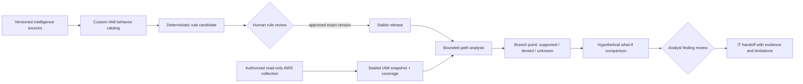

# IAM analyst workbench — product refocus and refurbishment plan

**Status:** Proposed for team/guide review, 2026-10-09; fixture-only implementation checkpoints are recorded below. This document does not approve a database migration, AWS access, deletion of existing UI, or publication of rules. The four-engine architecture and research question remain unless the team explicitly changes them.

Start implementation planning with the [schema-first delivery gates and AWS teammate handoff](26_SCHEMA_FIRST_DELIVERY_GATES.md). The broader table-by-table design remains [schema v0.1](24_WHOLE_PRODUCT_SCHEMA_PROPOSAL.md); neither document authorizes managed migration.

## The product in one sentence

For an IAM analyst, turn a *read-only, coverage-labelled snapshot* of one authorized AWS account into a small set of reproducible IAM path candidates, show which branches are supported, denied, hypothetical, or unknown, and produce an evidence-backed remediation handoff for IT. Engine 1 supplies versioned, human-reviewed rule ideas; it is not the whole product.

The first useful question is: **“For this identity, what could change its access, what evidence supports each branch, what remains unknown, and which control should IT review first?”** The user has selected a [paired pilot](decisions/ADR-016-two-identity-iam-pilot.md): two starting identities in the **same authorized AWS project/account**, one exposed comparator and one control comparator, investigated one at a time with a two-row overview and one sealed snapshot. This is **not** an account-wide security posture verdict.



**Critical meaning:** an observed AWS policy statement is not proof of effective permission; a candidate path is not a successful exploit; a hypothetical removed edge is not a real AWS change; a local reviewer alias is not authenticated identity. AI may critique a versioned packet, but cannot create approval, authority, or a verified finding.

## What we are keeping, changing, and deferring

| Area | Evidence-based current state | Plan |
|---|---|---|
| Engine 1 / foundry | Pinned source extracts, deterministic additional-credentials candidate, scenario/quality work, scoped local review and benchmark release exist; other rule families and real-account release assurance remain open ([README](../README.md), [status](00_STATUS_AND_TRUTH_MODEL.md), [spec](14_ENGINE_1_RESEARCH_GRADE_FOUNDRY_SPEC.md)). | **Keep and narrow.** Present a custom IAM behavior catalog with plain-language intent, source authority, action/target requirements, mapping confidence *and* explicit gaps. Make curation/review a secondary specialist workflow, not the analyst home screen. No source-count “confidence” score. |
| Engine 2 / account | Synthetic normalization exists. A proposed redacted handoff contract, local **observed-only** graph, one-identity evidence view, and narrow `CreateAccessKey` **policy-text** screen are fixture-tested. An opt-in read-only AWS transport can produce a redacted **in-memory** preview; there is no retained real snapshot, DB import, or effective-authorization resolver ([handoff contract](27_AWS_INVENTORY_HANDOFF_CONTRACT.md), [observed_graph.py](../src/fyp_iam/engine2/observed_graph.py), [identity_observation.py](../src/fyp_iam/engine2/identity_observation.py), [credential_policy_text.py](../src/fyp_iam/engine2/credential_policy_text.py)). `collect_live_account` still refuses AWS calls; the operator transport is separate ([live.py](../src/fyp_iam/engine2/live.py), [aws_authorization_read.py](../src/fyp_iam/engine2/aws_authorization_read.py)). | **Build the first durable read-only slice after the gates.** Seal input/coverage, retain collection errors, and use `unknown` for unread policy layers. Never use root credentials or store access keys. |
| Engine 3 / paths | Fixture-based bounded analysis, per-identity selection, rule-input digest and synthetic edge-removal what-if exist. The local verifier refuses non-synthetic profiles; none of this verifies AWS ([pipeline.py](../src/fyp_iam/engine3/pipeline.py), [InvestigationPage.tsx](../frontend/src/InvestigationPage.tsx)). | **Refurbish around one analyst question.** Pin a real-account-eligible release and sealed snapshot, show each hop with evidence and missing context, then bounded branch alternatives. No false effective-allow claims. |
| Engine 4 / handoff | Fixture findings and limitations exist, but no full real-account analyst-to-IT workflow is demonstrated ([README](../README.md)). | **Make the deliverable operational:** a reviewed finding and versioned handoff stating observed facts, inference, limitations, proposed control, affected paths, owner, and validation plan. |
| Database | Existing Supabase `foundry` schema was read-only audited at revision 0004 on 2026-10-08 and revision 0004 was rechecked on 2026-10-09; repository migrations/models extend beyond it ([audit](23_SCHEMA_CURRENT_STATE_AUDIT.md), [gates](26_SCHEMA_FIRST_DELIVERY_GATES.md)). Whole-product schema v0.1 is proposed, not approved. | **No migration yet.** Resolve the schema decision and test additive migration on a disposable clone before any live change. PostgreSQL-first; no Neo4j/Redis without measured need. |
| Portal | Navigation still leads with foundry operations, but `Identity investigation` now shows a two-identity synthetic ledger and one-at-a-time detail. It is not a live-account workspace ([foundry-navigation.ts](../frontend/src/foundry-navigation.ts), [ADR-016](decisions/ADR-016-two-identity-iam-pilot.md)). | **Reorganize, do not delete:** analyst landing → investigation → branches/what-if → handoff; tuck catalog and source/review operations into a clearly labelled Curation area. Keep deep links until replacement and regression checks exist. |

This is a **refocus**, not a greenfield rewrite. Preserve prior rule/evidence IDs, migrations, tests, and generated contracts. Treat [Engine 1 execution plan](15_ENGINE_1_EXECUTION_PLAN.md) as a subordinate foundry backlog, not the whole-product delivery order. [Old roadmap](08_ROADMAP_AND_TEAM_PLAN.md) and [architecture](02_ARCHITECTURE.md) contain proposed Neo4j/CloudGoat directions; they are not implementation mandates. CloudGoat is deferred at the user's direction. Do not silently erase the earlier three-family research ambition in the [foundry spec](14_ENGINE_1_RESEARCH_GRADE_FOUNDRY_SPEC.md); resolve it with the guide.

## Experience direction — monochrome, calm, evidence first

The interface should feel like a restrained analyst instrument, not a colorful SOC dashboard. High-contrast black/white/gray, typography, whitespace, and subtle borders; status must always have text/icon/pattern, never color alone. One primary question per screen. Progressive disclosure for raw evidence and technical details.

```text
Account / snapshot coverage  →  Identity investigation  →  Branch comparison  →  IT handoff
       “What was read?”           “What can change?”       “What if?”          “What to fix?”
                                     │
                         evidence + unknowns drawer

Secondary: Catalog / Sources / Rule assurance / Review queue / Operations
```

The graph is a *bounded explanation canvas*: left-to-right nodes and labelled edges, a selected “branch point” with alternatives, and a synchronized text outline/table for accessibility and print. Start with deterministic layout and small graphs; do not add a graph database or visual editor for its own sake. Show `observed configuration`, `model-inferred candidate`, `denied`, `unknown`, `hypothetical change`, and `lab/simulator verified` as distinct badges. A control recommendation may affect several paths; show the shared edge/control and count only *modelled* affected paths, not “vulnerabilities eliminated.” Defer a single account posture score until its denominator, coverage, and calibration are defensible.

## Delivery sequence — vertical slices with stop gates

Every slice must run locally with redacted/synthetic test data before authorized account data. Keep tasks small (typically 1–5 files); split rather than hide a redesign inside one task. Each task changes only its named area, adds/updates tests, and leaves the old flow usable. **No implementation begins from this plan until the P0 decisions below are reviewed.**

| ID | Work and dependency | Done when / verification |
|---|---|---|
| **P0.1** | Baseline inventory; no dependency. Record current branch/dirty state, working API/UI paths, tests, migrations and observed-vs-proposed claims in a short checkpoint. | A teammate can distinguish fixture demo from real AWS and run the baseline checks without secrets. Preserve all existing edits; do not commit someone else's work blindly. |
| **P0.2** | Approve one analyst story, first rule family, claim vocabulary, and schema/auth/retention gates; after P0.1. Update decision ledger/ADR only after discussion. | Guide/team accepts a one-page scenario and measurable claims. No unreviewed change to hypothesis, dataset labels, or metrics. |
| **P1.1** | Curated catalog card and mapping dossier; after P0.2. Reuse foundry entities rather than new parallel catalog storage. | One additional-credentials behavior has plain-English intent, required action/target, source-version links, unsupported mappings, limitations, and a reviewer state. Contract and UI tests cover missing evidence. |
| **P1.2** | Real-account release gate design/implementation; after P1.1 and approved identity/security decision. Keep review and publication separate. | Only exact immutable version/evidence/scope can be released; changed evidence makes assessment stale. Benchmark release is not relabelled real-account-safe. Negative authorization tests pass. |
| **P2.1** | AWS access readiness and cost/privacy guard; after P0.2, before AWS calls. Use only an explicitly authorized non-root read-only profile and account allowlist. | Preflight shows account match, identity class, allowed API set, bounded rate/cost, and redacted logs. A failed or partial preflight collects nothing further. No stored credentials. |
| **P2.2** | Minimum collector and sealed snapshot; after P2.1 and an approved schema migration path. Collect both starting identities in the **same account snapshot**, plus required target identities, attached/inline policies, default policy versions, trust, boundaries, and available organization context needed for the chosen pattern. | Each task has success/failure/coverage; snapshot has source-run IDs, hashes, timestamps and `data_kind=real_account_observed`. Missing pages, denies, or unavailable SCP/resource policy context are explicit. Replay tests use redacted recordings, not committed live data. Collector does not assign security labels. |
| **P3.1** | Normalize a small actual snapshot to graph; after P2.2. Pin graph edges to exact policy evidence and snapshot. | Reconciliation detects missing/duplicate edges; no cross-snapshot refs. An Allow statement alone cannot create an “effective allowed” verdict. Negative/unknown cases pass. |
| **P3.2** | One released-family path analysis for each starting identity; after P1.2 and P3.1. Bound depth, fanout and time; deduplicate equivalent paths. | Both runs pin the same exact release, analyzer version, limits, and sealed account snapshot; each hop cites a policy/ref or a gap; output is candidate/denied/unknown, never “exploit confirmed” from a read-only graph. |
| **P3.3** | Branch/what-if comparison; after P3.2. Reuse existing pure fixture what-if logic where sound. | Removing one *modelled* edge recomputes bounded paths against a copy and labels result hypothetical; underlying snapshot/release unchanged. Tests cover shared-control and unchanged-path cases. |
| **P4.1** | Analyst workflow UI; after P3.2, with P3.3 optional for first pass. Reorganize existing React routes, no destructive removal. | A two-row overview compares the exposed and control analyses without calling either account-wide secure; analyst opens one identity at a time to see coverage → path/no-path/unknown → evidence → branch point. Loading/empty/error states and keyboard/text equivalents work. Screen copy distinguishes fixture from real account. |
| **P4.2** | Finding review + versioned IT handoff; after P3.2/P4.1 and identity decision. | Analyst can accept/reject/needs-context with rationale; report pins all inputs, lists observed vs inferred vs hypothetical, shared remediation, rollback/validation steps, and residual unknowns. Export does not imply remediation applied. |
| **P5.1** | Evaluation and release readiness; after P4.2. Include benchmark positives, hard negatives, explicit denies, missing context and real-account collection failure. | Reproducible manifest/metrics, contract tests, migration/restart verification on disposable DB, a small analyst task walkthrough, and privacy/security review. Report real-account observations separately from fixture and simulator results. |

**Checkpoints:** after P0 (approved scope), P1 (credible catalog/release), P2 (sealed real snapshot), P3 (reproducible candidate/unknown), P4 (analyst handoff), P5 (defensible FYP evaluation). At each checkpoint: run relevant Python/frontend/contract tests, inspect actual UI, record what is verified and what is not, and stop if a safety/claim gate fails. Do not declare “complete” based on a polished screen or green fixture tests alone.

**Parallel ownership:** Engine 1 owner can prepare P1.1 while Engine 2 owner prepares P2.1 after P0; Engine 3 owner can harden fixture/unknown tests before P2.2; frontend owner can prototype information architecture with fixture data. P1.2, P2.2 and P3.2 have explicit gates and must not race schema/auth decisions. One integration owner maintains contracts, decision ledger, and cross-engine acceptance tests.

## Decision requests — recommended defaults, not assumptions

| Priority | Decision for team/guide | Recommended default and consequence |
|---|---|---|
| **Decided** | First user journey | [ADR-016](decisions/ADR-016-two-identity-iam-pilot.md): two starting identities in one authorized project/account and sealed snapshot; inspect one at a time and compare on an overview. Account-wide posture remains later work. |
| **P0** | First rule family and academic minimum? | **Additional credentials first** because current compiler/corpus exists; confirm whether the guide requires the three planned families for final evaluation. Do not delete the other two from the research plan. |
| **P0** | Who may approve a real-account rule and finding? | **Authenticated named analyst with auditable role** before shared/real-account publication. Existing local alias stays explicitly local/demo. If identity cannot be built in time, restrict real-account work to private, read-only observation with no claim of approved release. |
| **P0** | Database/retention boundary? | Review [schema proposal](24_WHOLE_PRODUCT_SCHEMA_PROPOSAL.md): single project, private backend, PostgreSQL-first; proposed 90-day real-account snapshot retention requires account-owner/guide approval. No live migration until an additive tested plan is signed off. |
| **P1** | Effective-permission threshold? | Treat missing SCP, boundary, resource-policy or condition context as **unknown**, not allow. Simulator/lab evidence, if later added, gets a separate verification type. This reduces confident findings but keeps claims honest. |
| **P1** | AWS access and report audience? | One authorized sandbox account, non-root read-only profile, no write/remediation API. IT handoff contains redacted aliases by default; full identifiers require controlled access. |
| **P2** | Account posture score and additional technology? | Defer both aggregate score and Neo4j/Redis until evaluation shows a user need and PostgreSQL/ordinary graph search fails a measured workload. CloudGoat stays out of the MVP. |

## Definition of the first credible milestone

A reviewer can open the **authorized** read-only AWS snapshot containing both starting identities, see exactly what was and was not collected, compare two bounded identity results, then investigate either identity individually. The exposed side has at least one policy-linked path candidate from an **eligible exact rule release**; the control side has no supported path for that rule or an explicit unknown. The analyst can inspect hops and missing context, compare one hypothetical control change without mutating AWS, and export a **reviewed, redacted** IT handoff. Until then, call the portal a fixture/demo or partial workbench, never a real-account attack-path verifier.

## Handoff packet for Cursor or another teammate

For any selected task, provide only: this plan and task ID; [AGENTS.md](../AGENTS.md); current [status](00_STATUS_AND_TRUTH_MODEL.md); the relevant engine contract/implementation/tests; [schema audit](23_SCHEMA_CURRENT_STATE_AUDIT.md) and [proposal](24_WHOLE_PRODUCT_SCHEMA_PROPOSAL.md) only if persistence is affected. Ask the agent to list verified vs assumed facts, keep changes within that task, preserve the dirty worktree, add negative/unknown tests, run the scoped checks, and report claims it cannot verify. Do not feed raw chats as requirements; use them only to trace a disputed decision. Any AWS call, live migration, identity change, or publication-scope change requires its named gate above, not a broad “continue” prompt.

**After plan approval:** update the charter/roadmap/status/navigation specs to link this plan and mark obsolete directions superseded rather than silently rewriting their history. Maintain `docs/15_ENGINE_1_EXECUTION_PLAN.md` as the detailed Engine 1 subplan. If the team chooses a different first journey, revise P1–P5 dependencies and acceptance before implementation.
