# ADR-009: Automated threat-to-rule foundry

## Status

Proposed. This supersedes the product direction in ADR-008. The first pinned source-to-experimental-rule slice is in this checkout. It does not implement the remaining rule families, optional third-party validators, a scheduler, stable publication, or a human-labeled benchmark beyond the three-scenario corpus. No non-ephemeral PostgreSQL database was found on this machine, so the checkpoint schema is replaced without a data migration. Local PostgreSQL has not been run.

## Date

2026-10-03

## Context

ADR-008 built a PostgreSQL mapping and a React page for one pinned technique. That checkpoint is useful infrastructure. It is not the product.

Engine 1 is an automated threat-to-rule foundry. It maintains an evidence-backed registry of AWS IAM attack-path rules. The portal is the control plane for that automation: observe runs, inspect evidence, resolve ambiguity, and evaluate quality. AI is a final grounded verifier. It is not the rule generator, the source of truth, an approver, or a silent editor.

## Audit of the checkpoint

Recorded against the schema in `20261003_0001` and the React page on `ddcc160`:

1. The React page requests `attack-t1548-assume-chain` by a hardcoded path.
2. The import path writes one pinned record. It is not a source registry.
3. `evidence_relations` has `from_record_id` and no destination entity.
4. `rule_candidates.record_id` references one normalized record.
5. `review_decisions` reference a candidate, not an immutable rule version.
6. `published_rules` stores `rule_version` as an integer and has no foreign key to `rule_versions`.
7. `raw_artifacts` stores hash and size, not payload bytes or a storage URI.
8. `source_runs.status` is an unconstrained string. The written value is only `completed`. Queued, running, partial, failed, retried, and cancelled jobs are not represented.
9. No adapter, scheduler, mapping engine, confidence model, AI verifier, or rule compiler exists. The T1548 rule is an allowlisted function in `intake.py`.
10. The `workbench` GitHub Actions workflow runs Python checks only. It does not install, type-check, test, or build the frontend.
11. A passing test of that allowlist does not show that T1548 is a correct IAM mapping.

The legacy allowlist remains in the tree so the earlier intake tests still describe that checkpoint. The foundry must not treat it as semantic truth.

## T1548

MITRE ATT&CK T1548 is Abuse Elevation Control Mechanism. The checkpoint maps it to a two-hop `sts:AssumeRole` pattern. That relationship is not a precise cloud-IAM mapping. The foundry rejects it. An honest unmapped primitive is preferred to a weak technique link.

## AWS Threat Technique Catalog

On 2026-10-03 the HTML catalog was reachable at `https://aws-samples.github.io/threat-technique-catalog-for-aws/`, and AWS security blog posts describe updates through June 2026. `https://github.com/aws-samples/threat-technique-catalog-for-aws` returned 404, and a GitHub repository search for that name under `aws-samples` returned no repository. No versioned JSON export was confirmed. HTML scraping is not an adapter. The catalog is not ingested. This is a source limitation, not an integration.

## Decision

Build the foundry on the model below. PostgreSQL remains the store. SQLite stays rejected. One worker process runs the pipeline. Celery is not introduced.

OWASP, NVD, and CISA KEV stay in a contextual lane. They do not create IAM rules from keyword overlap. Zero contextual relations is an acceptable result.

Experimental publication may follow deterministic validation plus the configured verifier. Stable publication requires a human decision on an exact rule version. Engine 3 consumes stable rules only, unless a caller explicitly opts into experimental rules.

Optional validators (Access Analyzer, Parliament, Cloudsplaining, PMapper) sit behind interfaces. A missing tool is recorded. It does not stop the core pipeline, and a disagreement is stored rather than overwritten.

## Data flow

```mermaid
flowchart LR
  discover[Discover source version]
  fetch[Fetch and hash]
  preserve[Preserve raw payload]
  parse[Parse]
  norm[Normalize entities]
  diff[Version diff]
  claims[Evidence claims]
  rel[Typed relations]
  prim[Attack primitives]
  compile[Compile candidate]
  det[Deterministic validators]
  corpus[Scenario corpus]
  ai[AI verifier]
  exp[Experimental registry]
  review[Exception review]
  discover --> fetch --> preserve --> parse --> norm --> diff --> claims --> rel --> prim --> compile --> det --> corpus --> ai
  ai -->|pass| exp
  ai -->|needs review or reject| review
```

## Schema

Names are the PostgreSQL tables. Foreign keys are required. Checks constrain lifecycles. Unique keys make a repeated run idempotent.

### sources

| Column | Constraint |
|---|---|
| source_id | primary key |
| source_key | unique |
| authority_tier | check 1, 2, or 3 |
| source_type | check taxonomy, service_reference, community_behavior, contextual |
| official_url | not null |
| enabled | boolean |
| schedule_cron | nullable text |

### source_versions

| Column | Constraint |
|---|---|
| version_id | primary key |
| source_id | foreign key sources |
| version_label | not null |
| discovered_at, effective_at | timestamptz |
| content_hash | not null |
| unique | source_id + content_hash |

### pipeline_runs and ingestion_runs

`pipeline_runs` is the parent job. `ingestion_runs` is one source attempt inside it.

Shared status check: `queued`, `running`, `succeeded`, `partial`, `failed`, `cancelled`.

`ingestion_runs` columns: run id, pipeline run foreign key, source foreign key, source version foreign key, attempt number, status, started and finished timestamps, fetched, created, updated, unchanged, and rejected counts, error JSON, retry_of foreign key, parser version.

A partial source failure sets that ingestion run to `partial` or `failed` and must not delete rows committed by a succeeded source in the same pipeline.

### raw_artifacts

Immutable. `payload` bytea or `storage_uri` must be present. Also MIME type, source-native id, content hash, byte count, retrieval time, parser version, and foreign keys to the source version and ingestion run. Unique on source version, native id, and hash.

### normalized_entities

Typed check: `technique`, `cloud_behavior`, `aws_action`, `aws_resource`, `condition_key`, `vulnerability`, `mitigation`, `attack_primitive_ref`. Unique on type, native id, and source version. Attributes are JSON. This table is not a single catalog node type.

### evidence_claims

Subject entity, predicate, object value or object entity, artifact foreign key, source location, extraction method, confidence, and optional validity interval.

### evidence_relations

`from_entity_id` and `to_entity_id` both foreign keys to entities. Relation type, mapping method, mapping confidence, and review state (`proposed`, `accepted`, `rejected`). Claims are attached through `evidence_relation_claims`.

### attack_primitives

Outcome, required actions, required resources, preconditions, state transition, resulting capability, limitations, mapping confidence, and `attack_mapping_state` of `mapped` or `unmapped`. Evidence is a many-to-many link to relations. Generator version is stored.

### rule_candidates and rule_versions

A candidate has a lifecycle and a generator/template version. Primitives and evidence entities are many-to-many. A rule version stores the immutable rule JSON, semantic hash, parent version foreign key, and generator version. Unique on candidate plus version number.

### validation_runs

Foreign key to the exact rule version. Validator name and version, result, findings JSON, corpus version, and execution time.

### ai_verifications

Foreign key to the exact rule version. Provider, model, prompt version, schema version, evidence snapshot hash, verdict (`pass`, `needs_review`, `reject`), findings, citations, and response hash.

### review_decisions

Foreign key to the exact rule version. Reviewer alias, decision, comment, timestamp. This slice has no login roles.

### publications

Foreign key to the exact rule version. Evidence snapshot hash, channel check `experimental` or `stable`, publication time. Unique on rule version plus channel. The service rejects a stable row without an approved review decision on that version.

### audit_events

Actor, action, object type, object id, correlation id, before hash, after hash, and structured detail JSON.

## Publication and Engine 3

- Experimental rules are marked experimental. The default Engine 3 input excludes them.
- Stable rules require the human decision above.
- The compiled document uses the existing proposed-rule shape so Engine 3 can parse it. `status=approved` is not set by the compiler or by the verifier.

## Alternatives considered

### Keep the ADR-008 tables and add columns

Rejected. The missing destination entity, the single-record candidate, and the publication integer are structural. This branch has no production data.

### Generate rules with an LLM

Rejected. The compiler uses versioned templates over attack primitives. The verifier only returns schema-constrained JSON and cannot rewrite a candidate.

### Scrape the Threat Technique Catalog HTML

Rejected. The site is not a pinned machine-readable source.

## Consequences

- The next migration drops the checkpoint tables and creates this schema.
- The first implementation slice must ingest pinned MITRE STIX, AWS Service Reference JSON, and selected Stratus metadata, then compile at least one candidate without a hardcoded artifact id in the API or the page.
- T1548 stays rejected unless a later ADR shows a defensible relation from primary evidence.
- Local PostgreSQL is still not installed here. CI remains the place that applies migrations.
